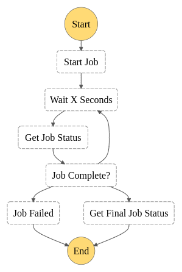

# AWS CDK Stack with Step functions, lambdas and Dynamo DB 

This project demonstrates how to setup a AWS stack with `aws-cdk`.
Inspect the code at `infra` to see how the various components are defined.
Notice we are also able to pass environement variable to the lambda function so that it can initial the step function tasks.

```
├── infra
│   ├── bin/index.ts   <- Entry point to your stack definitions
│   ├── services       <- Service definitions
│   ├── stacks         <- Stack definitions
│   └── utils
├── src                <- Application code
├── cdk.json           <- Entry point for aws-cdk cli
├── package.json 
└── README.md
```

## Requirements

You need to install aws-cdk globally: 
```
npm i -g aws-cdk
```

## Build and Deploy
It would be easy to integrate this build and deploy process on any CI pipeline.

1. Install the application code: `npm i` or `yarn`
1. Install the infra code `cd infra` and `npm i`
1. Finally run build & deploy: `npm run deploy` or `yarn deploy`

Once deployed you should now have:
* A DynamoDB table called `jobs`
* 3 Lambda functions (2 With Rest API Integration)
* A Rest API Gateway with 2 methods (**GET** | **POST**) on `/jobs` resource
* A state machine with conditional steps

### State machine



## Testing out the deployed services


* You can invoke the state machine manually via AWS console to see the step functions in action.
* Or you can invoke a lambda function that triggers the step function tasks via **API Gateway** `POST /jobs`.
